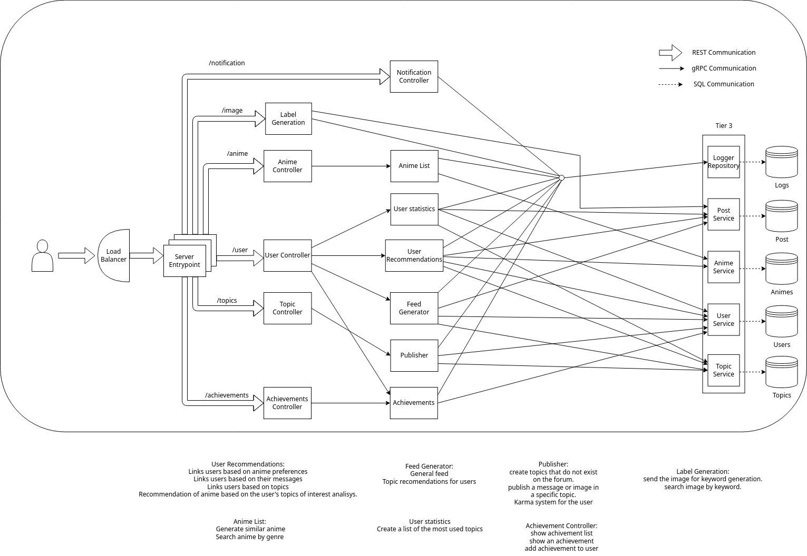
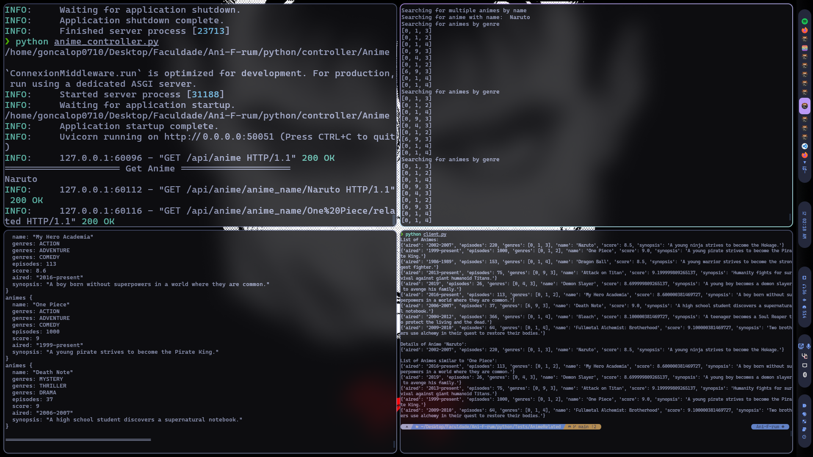
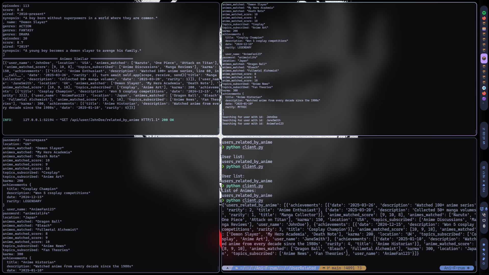
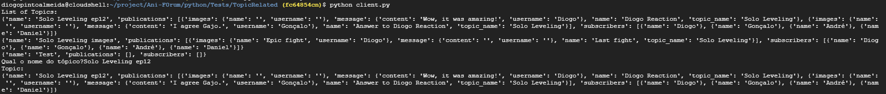
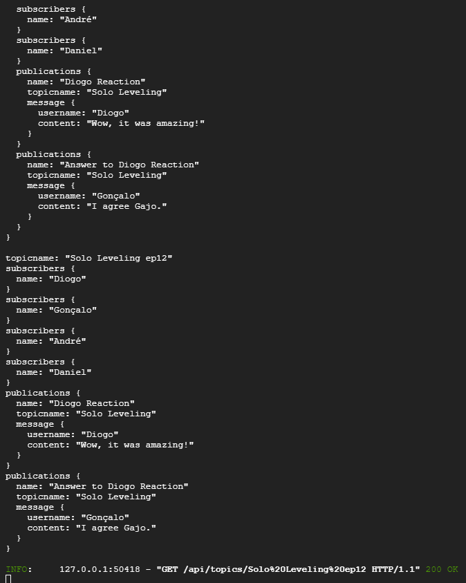
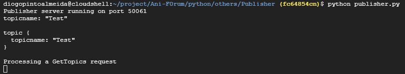
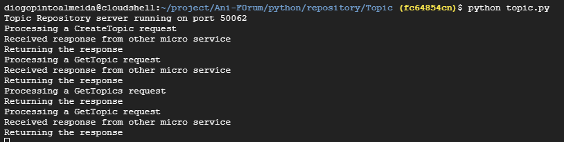

# Ani-F-rum Project

## Authors

- André Reis - fc58192
- Daniel Nunes - fc58257
- Diogo Almeida - fc64854
- Gonçalo Pinto - fc58178

## Overview

Ani-F-rum is a cloud-based application designed to create an anime forum with a built-in social network. It provides REST and gRPC APIs for managing users, anime, topics, and recommendations. The project integrates multiple microservices to handle various functionalities such as user management, anime recommendations, topic discussions, and achievements.

---

## Architecture

The project is built using a microservices architecture, with each service responsible for a specific domain. Communication between services is achieved using gRPC, while REST APIs are exposed for external interaction.



### Server Entry Point

The server entry point is the first module to recive the client request and send to the respective controller.
It is still not implemented.

### Controllers

Controllers are responsible for implementing the logic behind the REST API endpoints. They act as intermediaries between the client requests and the underlying services or repositories. For example:
- The **Anime Controller** (`anime_controller.py`) handles anime-related operations such as retrieving anime details and fetching similar anime.
- Controllers often use gRPC services to fetch data or perform operations, ensuring a clean separation of concerns.

### Others

The "Others" section refers to additional services or utilities that support the main functionality of the application. These include:
- **AnimeList Service**: Handles anime-related data retrieval and recommendations. It interacts with the `AnimeRepository` to fetch data from the database.
- These services are implemented using gRPC and are defined in their respective `.proto` files.

### Repository

Repositories are responsible for interacting with the database or data source. They provide low-level data access methods that are used by the gRPC services. For example:
- **AnimeRepository**: Fetches anime data from the database, such as anime details, genres, and related anime.

### Connections and Relationships

1. **REST APIs and Controllers**:
   - REST API endpoints defined in `swagger.yml` files are mapped to controller functions.
   - Controllers handle the business logic and call gRPC services to fetch or process data.

2. **Controllers and gRPC Services**:
   - Controllers use gRPC clients to communicate with services like `UserRecommendations` and `AnimeList`.
   - For example, the `get_related_by_anime` function in the User Controller calls the `GetUsersRelatedByAnime` method in the `UserRecommendations` service.

3. **gRPC Services and Repositories**:
   - gRPC services fetch data from repositories. For example, the `AnimeList` service calls the `AnimeRepository` to retrieve anime data.
   - Repositories interact directly with the database or data source.

4. **Common Protobuf Definitions**:
   - Shared data structures like `User` and `Anime` are defined in common `.proto` files and used across services to ensure consistency.

This layered architecture ensures modularity, scalability, and maintainability by separating concerns and defining clear interfaces between components.

---

## REST APIs

### User REST API
- **File**: [`python/controller/Users/swagger.yml`](python/controller/Users/swagger.yml)
- **Description**: Manages user-related operations such as creating users, retrieving user details, and managing achievements.
- **Endpoints**:
  - `/user`: Create a new user. (Not fully implemented)
  - `/user/{user_name}/related_by_anime`: Get users related by anime preferences.
  - `/user/{user_name}/related_by_message`: Get users related by messages. (Not fully implemented)
  - `/user/{user_name}/achievements`: Retrieve user achievements. (Not tested)
  - `/user/{user_name}/{achievement_name}`: Add an achievement to a user. (Not tested)
  - `/user/{user_name}/karma`: Retrieve user karma. (Not working)
  - `/user/{user_name}/track_records`: Retrieve user track records. (Not fully implemented)
  - `/user/{user_name}/messages`: Retrieve user messages. (Not fully implemented)
  - `/user/{user_name}/recomended_animeList`: Get recommended anime for a user. (Not tested)

### Anime REST API
- **File**: [`python/controller/Anime/swagger.yml`](python/controller/Anime/swagger.yml)
- **Description**: Manages anime-related operations such as retrieving anime details and recommendations.
- **Endpoints**:
  - `/anime`: Retrieve a list of all anime. (Working and tested)
  - `/anime/anime_name/{anime_name}`: Retrieve details of a specific anime. (Working and tested)
  - `/anime/anime_name/{anime_name}/related`: Retrieve related anime. (Working and tested)

### Topic REST API
- **File**: [`python/controller/Topics/swagger.yml`](python/controller/Topics/swagger.yml)
- **Description**: Manages topic-related operations such as retrieving topics, creating topics, and publishing messages or images in topics.
- **Endpoints**:
  - `/topics`: Retrieve a list of topics or create a new topic. (create is not working due to an error in POST request)
  - `/topics/{topic_name}`: Retrieve a specific topic or publish a message/image in the topic. (publish is not working due to an error in POST request)
  - `/topics/{user_name}`: Retrieve a personalized topic list for a user.
  - `/topics/{user_name}/feed`: Retrieve a personalized publication feed for a user.


## gRPC Services

### UserRecommendations Service
- **File**: [`protobufs/others/UserRecommendations.proto`](protobufs/others/UserRecommendations.proto)
- **Description**: Provides recommendations for users based on anime preferences, messages, and topics.
- **Methods**:
  - `GetUsersRelatedByAnime`: Retrieve users related by anime preferences. (Working and tested)
  - `GetUsersRelatedByMessage`: Retrieve users related by messages. (Not implemented)
  - `GetUsersRelatedByTopics`: Retrieve users related by topics.
  - `GetRecomendedAnimeListByTopics`: Retrieve recommended anime based on topics.

### AnimeList Service
- **File**: [`protobufs/others/AnimeList.proto`](protobufs/others/AnimeList.proto)
- **Description**: Handles anime data retrieval and recommendations.
- **Methods**:
  - `GetAllAnimes`: Retrieve all anime. (Working and tested)
  - `GetAnimeByName`: Retrieve details of a specific anime. (Working and tested)
  - `GetMultipleAnimeByName`: Retrieve details of multiple anime. (Working and tested)
  - `GetSimilarAnime`: Retrieve similar anime. (Working and tested)
  - `GetRecomendedAnimeList`: Retrieve recommended anime for a user. (Not tested and not fully implemented)

### Publisher Service
- **File**: [`protobufs/others/Publisher.proto`](protobufs/others/Publisher.proto)
- **Description**: Acts as an intermediary between the Topic REST API and the TopicRepository service. It handles requests for topics, creating topics, and publishing content.
- **Methods**:
  - `GetTopics`: Retrieve all topics.
  - `CreateTopic`: Create a new topic. (not tested connected with repository)
  - `GetTopic`: Retrieve a specific topic.
  - `PublishInTopic`: Publish a message or image in a topic. (not tested connected with repository)

### UserStatistics Service
- **File**: [`python/others/UserStatistics/UserStatistics.py`](python/others/UserStatistics/UserStatistics.py)
- **Description**: Provides various statistics and data about users, including their activity, karma, and most-used topics.
- **Methods**:
  - `GetTop10`: Retrieve the top 10 anime watched by a user based on their scores. (Not tested)
  - `GetMostUsedTopics`: Retrieve the most frequently used topics by a user. (Not tested)
  - `GetUserKarma`: Calculate and retrieve the karma value of a user based on their posts and topic popularity.  (Not tested)
  - `GetAllUsers`: Retrieve a list of all users in the system.  (Not tested)
  - `GetUserByName`: Retrieve details of a specific user by their username.  (Not tested)

### FeedGenerator Service
- **File**: [`python/others/FeedGenerator/FeedGenerator.py`](python/others/FeedGenerator/FeedGenerator.py)
- **Description**: Generates personalized feeds for users based on their subscribed topics and associated publications.
- **Methods**:
  - `GetFeed`: Retrieve a list of all publication from all topics the user is subscribed to. (Not tested)
  - `GetTopicFeed`: Retrieve a list of topics the user is subscribed to. (Not tested)
  
### Achievements Service
- **File**: [`protobufs/others/Achievements.proto`](protobufs/others/Achievements.proto)
- **Description**: Manages user achievements within the application. It handles the creation, retrieval, and assignment of achievements to users.
- **Methods**:
  - `GetAchievement`: Retrieve all available achievements. (not tested)
  - `GetAchievements`: Retrieve achievements for a specific user. (not tested)
  - `UpdateAchievement`: Add a new achievement to the system. (not tested)

### AnimeRepository Service
- **File**: [`protobufs/repository/AnimeRepository.proto`](protobufs/repository/AnimeRepository.proto)
- **Description**: Interacts with the database to fetch anime data.
- **Methods**:
  - `Animes`: Retrieve all anime. (Working and tested)
  - `AnimeByName`: Retrieve details of a specific anime. (Working and tested)
  - `MultipleAnimeByName`: Retrieve details of multiple anime. (Working and tested)
  - `AnimeRelatedByGenre`: Retrieve anime by genre. (Working and tested)

### UserRepository Service
- **File**: [`protobufs/repository/UserRepository.proto`](protobufs/repository/UserRepository.proto)
- **Description**: Interacts with the database to fetch user data.
- **Methods**:
  - `GetUser`: Retrieve details of a specific user. (Working and tested)
  - `GetAllUsers`: Retrieve all users. (Not tested)
  - `GetUsersThatWatchedAnime`: Retrieve users who watched specific anime. (Working and tested)
  - `UpdateUser`: Update user details. (Not fully implemented)

### TopicRepository Service
- **File**: [`protobufs/repository/TopicRepository.proto`](protobufs/repository/TopicRepository.proto)
- **Description**: Interacts with the database to fetch topics data.
- **Methods**:
  - `MostUsedTopics`: Retrieve the most used topics. (not implemented)
  - `TopicSubscribers`: Retrieve all users subcribed to a specific topic. (not implemented)
  - `Recomendation`: Retrieve the publication names related to a theme. (not implemented)
  - `GetTopics`: Retrieve all the topics data.
  - `CreateTopic`: Create a new topic. (not tested)
  - `GetTopic`: Get a specific topic data.
  - `PublishMessage`: Publish a message to a topic. (not tested)
  - `PublishImage`: Publish an image to a topic. (not tested)


## Common Protobuf Definitions

### Anime
- **File**: [`protobufs/Common/Anime.proto`](protobufs/Common/Anime.proto)
- **Description**: Defines the structure of an anime object.
- **Fields**:
  - `name`: Name of the anime.
  - `genres`: List of genres.
  - `episodes`: Number of episodes.
  - `score`: Rating score.
  - `aired`: Airing date.
  - `synopsis`: Synopsis of the anime.

### User
- **File**: [`protobufs/Common/User.proto`](protobufs/Common/User.proto)
- **Description**: Defines the structure of a user object.
- **Fields**:
  - `user_name`: Username.
  - `password`: Password.
  - `location`: User location.
  - `animes_watched`: List of watched anime.
  - `anime_watched_score`: Scores for watched anime.
  - `topics_subscribed`: Subscribed topics.
  - `karma`: User karma points.
  - `achievements`: List of achievements.

### Topic
- **File**: [`protobufs/Common/Topic.proto`](protobufs/Common/Topic.proto)
- **Description**: Defines the structure of a Topic object.
- **Fields**:
  - `topicname`: The name of the topic.
  - `subscribers`: A list of subscribers to the topic, represented as `Subscriber` objects.
    - **Subscriber Fields**:
      - `name`: The name of the subscriber.
  - `publications`: A list of publications in the topic, represented as `Publication` objects.
    - **Publication Fields**:
      - `name`: The name of the publication.
      - `topicname`: The name of the topic the publication belongs to.
      - `content`: The content of the publication, which can be either:
        - `Message`: A message object containing:
          - `username`: The username of the message author.
          - `content`: The content of the message.
        - `Image`: An image object containing:
          - `name`: The name of the image.
          - `username`: The username of the image uploader.

---

## Controllers

### User Controller
- **File**: [`python/controller/Users/user_controller.py`](python/controller/Users/user_controller.py)
- **Description**: Implements the logic for user-related REST endpoints.
- **Key Functions**:
  - `get_related_by_anime`: Retrieves users related by anime preferences. (Working and tested)
  - `all_users`: Retrieves all users. (Not tested)
  - `get_user`: Retrieves details of a specific user. (Not tested)
  - `get_karma`: Retrieves user karma. (Not working)
  - `top10Anime`: Retrieves the top 10 anime for a user. (Not tested)
  - `list_topics`: Retrieves the most used topics. (Not tested)

### Anime Controller
- **File**: [`python/controller/Anime/anime_controller.py`](python/controller/Anime/anime_controller.py)
- **Description**: Implements the logic for anime-related REST endpoints.
- **Key Functions**:
  - `all_anime`: Retrieves all anime. (Working and tested)
  - `get_anime`: Retrieves details of a specific anime. (Working and tested)
  - `get_similar_anime`: Retrieves similar anime. (Working and tested)

### Topics Controller
- **File**: [`python/controller/Topics/topics.py`](python/controller/Topics/topics.py)
- **Description**: Implements the logic for topic-related REST endpoints.
- **Key Functions**:
  - `all_topics`: Retrieves all topics by calling the `GetTopics` method in the Publisher service.
  - `create`: Creates a new topic by calling the `CreateTopic` method in the Publisher service. (create is not working due to an error in POST request)
  - `get_topic`: Retrieves a specific topic by calling the `GetTopic` method in the Publisher service.
  - `publish`: Publishes a message or image in a topic by calling the `PublishInTopic` method in the Publisher service. (publish is not working due to an error in POST request)


---

## Dataset

The project uses the [MyAnimeList Dataset](https://www.kaggle.com/datasets/dbdmobile/myanimelist-dataset) for anime-related data. The dataset includes titles, genres, ratings, and more.

---

## Tests Preview

<div align="center">
  
  <p><em>Figure: Anime related Test Results</em></p>
</div>

<div align="center">
  
  <p><em>Figure: User related Test Results</em></p>
</div>

---

<div align="center">
  
  <p><em>Figure: Topic Client Test Results</em></p>
</div>

<div align="center">
  
  <p><em>Figure: Topic Controller Results</em></p>
</div>

<div align="center">
  
  <p><em>Figure: Topic Publisher Test Results</em></p>
</div>

<div align="center">
  
  <p><em>Figure: Topic Repository Test Results</em></p>
</div>

## How to Run

1. **Enter Venv workspace**
  ```python
   python -m venv venv
  ```
  ```python
   source venv/bin/activate
  ```

2. **Install Dependencies**:
  ```python
   pip install -r requirements.txt
  ```
  ```python
   pip install "connexion[flask]"
  ```
  ```python
   pip install "connexion[uvicorn]" 
  ```

---

### **Run Topic related operations**

Open the repository microservice for topics.
```python
  python python/repository/Topic/topic.py
```

Open the publisher microservice. (connection between the controller and the repository)
```python
  python python/others/Publisher/publisher.py
```

Open the controller related to topic operations.
```python
  python python/controller/Topics/topics.py
```

Open the client that tests the topic controller.
```python
  python python/Tests/TopicRelated/client.py
```

---

### **Run Anime related operations**
  
Open the repository microservice for animes.
```python
  python python/repository/Anime/anime_repository.py
```

Open the anime list microservice. (connection between the controller and the repository)
```python
  python python/others/AnimeList/anime_list.py
```

Open the controller related to anime operations.
```python
  python python/controller/Anime/anime_controller.py
```

Open the client that tests the anime controller.
```python
  python python/Tests/AnimeRelated/client.py
```

---

### **Run User related operations**
  
Open the repository microservice for users.
```python
  python python/repository/User/user_repository.py
```

Open the user recommendations microservice. (connection between the controller and the repository)
```python
  python python/others/UserRecommendations/user_recommendations.py
```

Open the controller related to user operations.
```python
  python python/controller/Users/user_controller.py
```

Open the client that tests the user controller.
```python
  python python/Tests/UserRelated/client.py
```